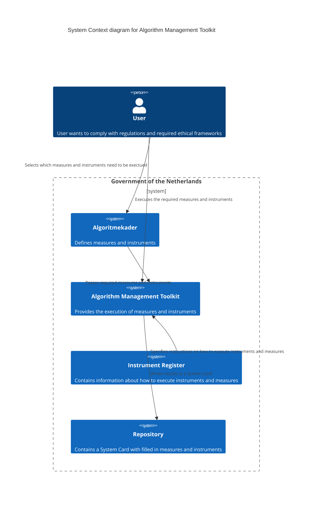
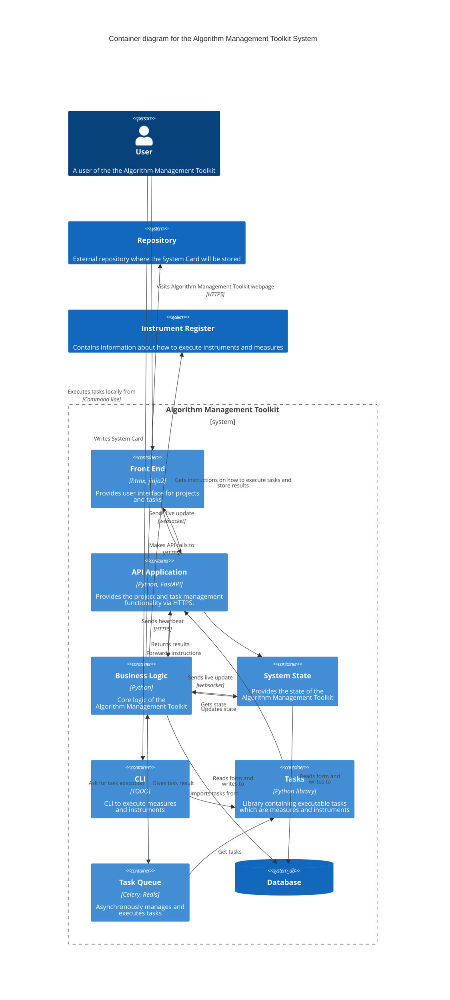

# Algorithm Management Toolkit Architecture

This document contains architectural decisions related to the Algorithm Managment Toolkit.

## System Context
The Algorithm Management Toolkit is an application that users can use to complete requirements
that are specified by the algoritmekader. The diagram below sketches the broader system context
of this Algorithm Management Toolkit.

### Example
Suppose a data science team is working on an ML-algorithm. A team member visits the Algoritmekader
website and sees that among other things an IAMA is a required to be performed. The user selects
the IAMA task from the Algoritmekader and is forwarded to the Algorithm Management Toolkit. Here
the user can login and import the IAMA task. The Algorithm Management Toolkit imports the instructions
on how to execute an IAMA and how to store the results from the Instrument Register. Now the user can
perform the IAMA from within the Algorithm Management Toolkit. Relevant stakeholders can also login
to the project page of the Algorithm Management Toolkit to answer questions from the IAMA. Relevant
discussions can be captured within the toolkit as well. Upon completion the IAMA results are written
to an Assessment Card within a System Card to a user specified location, usually a remote repository
where the source code of the algorithm resides.

## Container Diagram of the Algorithm Management Toolkit System

