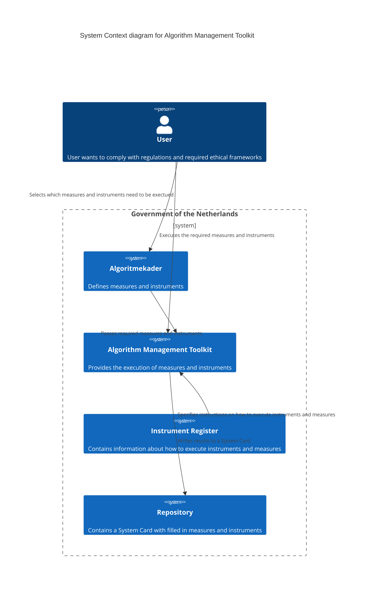
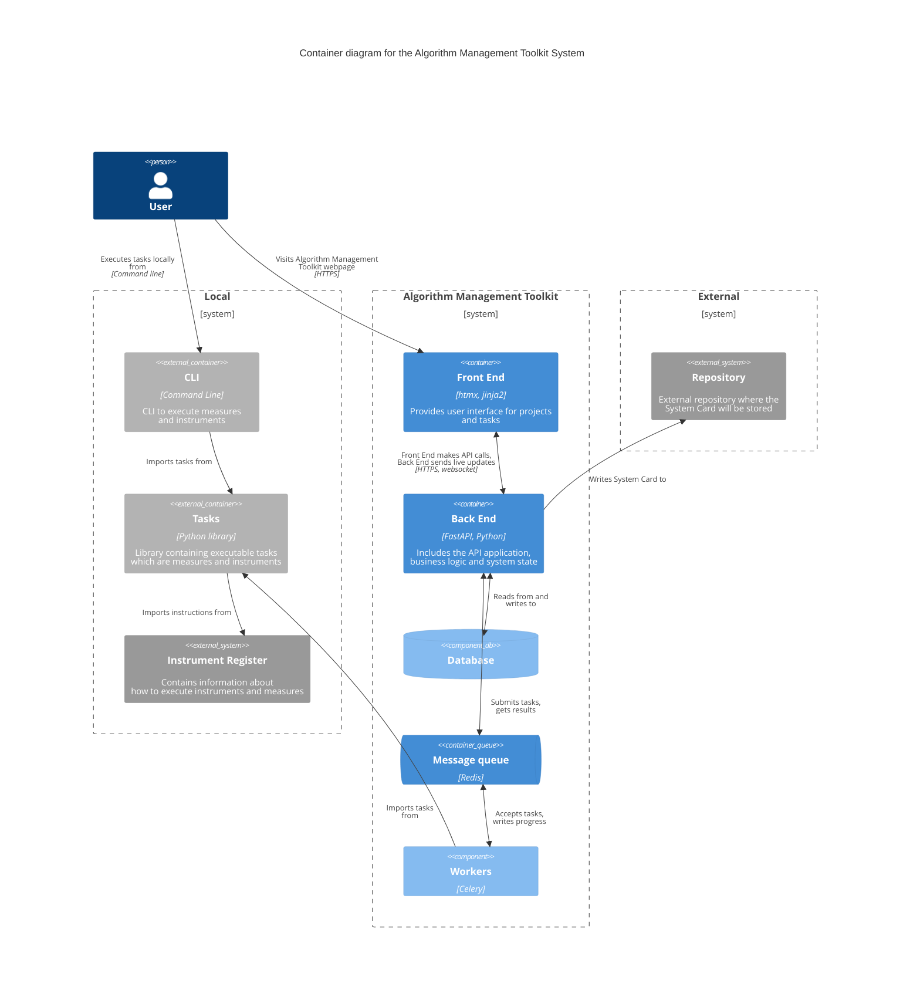
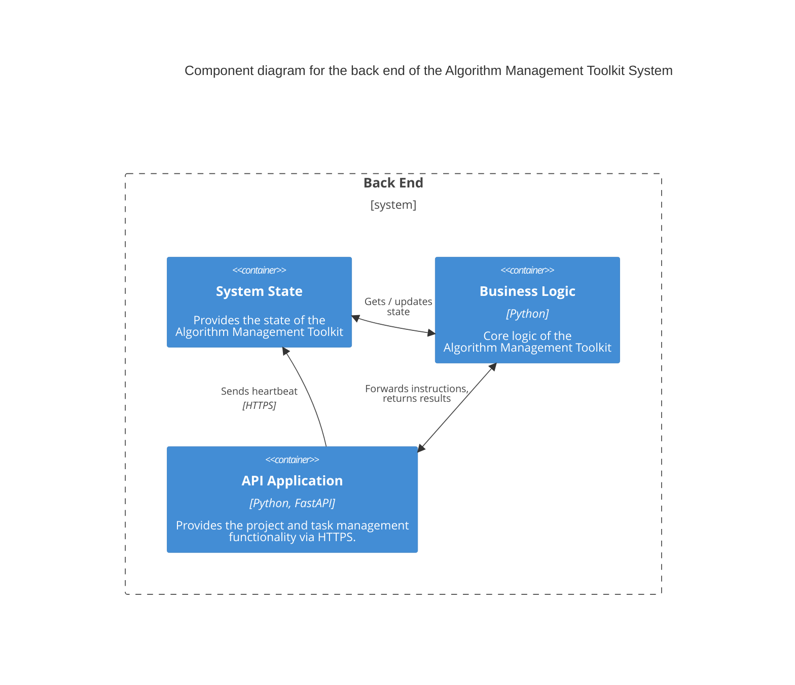

# Algorithm Management Toolkit Architecture

This document contains architectural decisions related to the Algorithm Managment Toolkit.

## System Context

The Algorithm Management Toolkit is an application that users can use to complete requirements
that are specified by the algoritmekader. The diagram below sketches the broader system context
of this Algorithm Management Toolkit.

### Example
Suppose a data science team is working on an ML-algorithm. A team member visits the Algoritmekader
website and sees that among other things an IAMA is a required to be performed. The user selects
the IAMA task from the Algoritmekader and is forwarded to the Algorithm Management Toolkit. Here
the user can login and import the IAMA task. The Algorithm Management Toolkit imports the instructions
on how to execute an IAMA and how to store the results from the Instrument Register. Now the user can
perform the IAMA from within the Algorithm Management Toolkit. Relevant stakeholders can also login
to the project page of the Algorithm Management Toolkit to answer questions from the IAMA. Relevant
discussions can be captured within the toolkit as well. Upon completion the IAMA results are written
to an Assessment Card within a System Card to a user specified location, usually a remote repository
where the source code of the algorithm resides.

## Container Diagram of the Algorithm Management Toolkit System
Below is a context diagram of the Algorithm Management Toolkit, with some additional remarks about
its components.

### Walkthrough
Suppose a user wants to perform a specific task from the Algoritmekader. To execute this task, the user has 2 options.

The first option is to execute the task locally by using the command line interface tool (CLI). The CLI tool imports the task from a Python library named `Tasks`. This library contains executable tasks that implement the measures and instruments from the `Instrument Register` (which are specified in the Algoritmekader). Instructions on how to perform these tasks are imported from the Instrument Register. There exists a one-to-one correspondence between measures and instruments in the `Instrument Register` and the task's within the `Tasks` library.

The second option is to use the Algorithm Management Toolkit (AMT). The user starts by visiting the Algorithm Management Toolkit website. Here, the user encounters a front end interface showing a planning board for projects and tasks. This planning board contains 3 columns: ‘To do’,  ‘Doing’ and ‘Done’. When a user drags a task from ’To do’ to ‘Doing’, the front end makes an API call to the back end of the AMT.

The backend consists of three components, showed in the component diagram at the end of this page.
1. An API application, which provides the project and tasks management functionality via HTTPS.
2. The business logic, which is the core logic of the AMT.
3. A system state, which provides the state of the AMT.

When receiving an API call, the API application forwards the instruction to the business logic. The business logic, in turn, updates the system state and submits the task to the Redis message queue. The message queue stores the task messages until a Celery worker is ready to process a specific task. When a Celery worker is available, it uses the task library to execute the task. After the task is completed by the worker, the result is sent back to the business logic via the message queue. The business logic now sends an update to the system state and writes the result to the database. Finally, the business logic writes a System Card to an external repository.

Meanwhile, the API application sends regular heartbeats to the system state to check for updates. The system state receives updates from the business logic and checks for updates by reading from the database. When a state is updated (for example, a task is "done" or "failed with error X"), the business logic returns this to the API application. Using a websocket, the API application sends live updates back to the front end, to make sure the planning board stays up to date.

## Component diagram of the back end of the Algorithm Management Toolkit
Below is a component diagram of the back end of the Algorithm Management Toolkit, with some additional remarks about its components.

